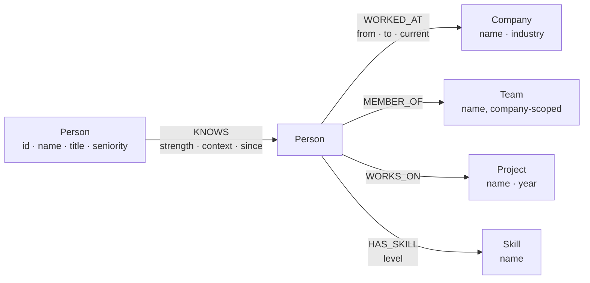

# Vouch

**A referral-path finder.** You are targeting someone at a company. Who in your
network can introduce you, through what chain of people, and how strong is
each link in that chain?

[](https://github.com/Lokesh-Tallapaneni/Vouch/actions/workflows/ci.yml)

**[Live demo →](https://vouch-g4tk.onrender.com/)** — no sign-up needed; every
page works signed out, browsing as the seeded protagonist. Both the free
database instance and the free host spin down when idle, so the first request
after a quiet period can take 10–20s while they wake. Refresh once if the
first load is slow.

<!-- Recording link goes here once uploaded. -->

---

Reach into a company and see who can introduce you, ranked by how strong the
route is rather than how few hops it takes:


Open any route to see the full chain and a pre-written introduction message,
addressed to the first person in it:


The landing page, which explains the product by drawing a route rather than
describing one:


Network health answers the question a relational schema handles worst — who
is the *only* bridge between two teams that otherwise share nobody, and which
skills rest on a single person:


---

## The problem

Cold applications get ignored; warm introductions get answered. The people
who can make that introduction are already in your network — you just can't
see the path to them, or which of several paths is worth asking for.

---

## Why a graph database?

*"Do I know anyone at Acme?"* is set membership — any database answers it.
*"**How** do I reach someone at Acme, and which route is most likely to
work?"* demands the route itself — `You → Priya → Arjun → target` — plus a
confidence score computed **along** that route. The route is the answer, not
a byproduct of finding it.

Three things make that a graph problem specifically:

- **Depth is unknown in advance.** A target might be one hop away or four —
  the measured data below shows both. A relational schema has to fix a
  maximum join depth up front, or fall back to a recursive CTE that
  accumulates the path into an array by hand and guards cycles with a
  visited set.
- **Ranking happens along the path, not over rows.**
  `reduce(s = 1.0, r IN relationships(path) | s * r.strength)` multiplies
  tie strength down the whole chain in one expression. In SQL, path-dependent
  aggregation means either a procedural loop or materialising every candidate
  path first and scoring it afterwards.
- **The interesting query is a negative pattern.** "Who is the only bridge
  between two otherwise-disconnected teams" needs `NOT (a)-[:KNOWS]-(c)`
  inside a three-node match — a `NOT EXISTS` correlated subquery over a
  double self-join in SQL, and close to unreadable at that.

**The honest trade-off:** a relational store would be the better home for the
flat reporting this app deliberately doesn't do — headcount by department,
tenure distributions, hiring-funnel metrics. Those are aggregations over
rows, which is exactly what SQL is good at. We chose the tool for the shape
of the questions, not out of enthusiasm for graphs in general.

---

## Data model



| Node / relationship | Cardinality (seeded) | Notes |
|---|---:|---|
| `Person` | 500 | one fixed protagonist (`id: "me"`) plus 499 others |
| `Company` | 8 | |
| `Team` | 40 | company-scoped: a team belongs to exactly one company |
| `Skill` | 40 | |
| `Project` | 25 | company-agnostic — shared projects are what create most cross-company `KNOWS` edges |
| `KNOWS` | 2,736 | acquaintance |
| `WORKED_AT` | 655 | employment, current and past |
| `HAS_SKILL` | 1,788 | |
| `WORKS_ON` | 1,009 | |
| `MEMBER_OF` | 500 | |

613 nodes, 6,688 relationships total.

**`KNOWS` is stored once, traversed undirected.** It's a single directed edge
in storage, always queried as `-[:KNOWS]-`, because acquaintance is
symmetric. Storing one edge instead of two halves the write volume and
removes any chance of the two directions drifting apart. The cost, named
plainly: this model cannot represent asymmetric familiarity — the case where
one side considers the tie stronger than the other does.

**Employment *history*, not just current employer, is what makes the model
work at all.** A person who left a company two years ago is still a route
into that company — `WORKED_AT` carries `from`/`to`/`current` rather than a
single current-employer property specifically so those edges survive after
someone moves on. Without that history the graph degenerates into an org
chart, and "reach into a target company" collapses to "do I already work
there."

---

## The queries

All Cypher is parameterised and lives under `app/db/cypher/` — one module per
domain, one constant per query, nothing built with an f-string or
concatenation.

**Introduction routes** (`app/db/cypher/referrals.py`) — *the best ways to
reach one specific person.*

```cypher
MATCH path = allShortestPaths(
  (me:Person {id: $viewer_id})-[:KNOWS*1..5]-(target:Person {id: $target_id})
)
WHERE length(path) <= $max_hops
WITH path,
     reduce(score = 1.0, r IN relationships(path) | score * r.strength) AS confidence
RETURN [n IN nodes(path) | n.name] AS chain, length(path) AS hops,
       round(confidence * 1000) / 1000.0 AS confidence
ORDER BY confidence DESC, hops ASC
LIMIT $limit
```

`allShortestPaths`, not `shortestPath`: every equally-short route is wanted
so they can be ranked against each other by confidence — `shortestPath`
returns one arbitrary path and would hide the strongest one.

**Company insiders** (same module) — *who you can reach at a target company,
ranked by how well.* `shortestPath` here instead, because this runs once per
insider — up to several dozen per company — and enumerating every
equally-short path to each one would be a lot of work for an answer the UI
never shows. On CognoDB, `shortestPath` doesn't actually return a single
path — see divergence 5 in [Notes on CognoDB](#notes-on-cognodb) — so the
query aggregates to the strongest path per insider before the final `LIMIT`.

**Person profile** (`app/db/cypher/people.py`) — *everything the profile
screen needs in one round trip, including mutual connections with the
viewer.*

```cypher
MATCH (p:Person {id: $person_id})
OPTIONAL MATCH (p)-[w:WORKED_AT]->(c:Company)
OPTIONAL MATCH (p)-[:HAS_SKILL]->(s:Skill)
OPTIONAL MATCH (p)-[:WORKS_ON]->(pr:Project)
OPTIONAL MATCH (p)-[:MEMBER_OF]->(t:Team)
OPTIONAL MATCH (viewer:Person {id: $viewer_id})-[:KNOWS]-(mutual:Person)-[:KNOWS]-(p)
RETURN p.id AS id, p.name AS name, ...
```

`OPTIONAL MATCH` is load-bearing, not decoration: a person with no projects
must still render a profile rather than vanish from the result. It's the
graph equivalent of a `LEFT JOIN`.

**Brokers** — *who is the only bridge between two otherwise-disconnected
teams.* The negative-pattern exhibit:

```cypher
MATCH (a:Person)-[:KNOWS]-(b:Person)-[:KNOWS]-(c:Person)
WHERE a <> c AND a.team <> c.team
  AND NOT (a)-[:KNOWS]-(c)
WITH b, count(DISTINCT [a.team, c.team]) AS bridged_pairs
RETURN b.name AS broker, b.title AS title, bridged_pairs
ORDER BY bridged_pairs DESC
LIMIT 15
```

`NOT (a)-[:KNOWS]-(c)` is the line worth stopping on — it's what a `NOT
EXISTS` correlated subquery over a double self-join looks like when it isn't
fighting the language.

**Bus factor** — *skills on a project held by exactly one person,* a
project-continuity risk report:

```cypher
MATCH (pr:Project)<-[:WORKS_ON]-(p:Person)-[:HAS_SKILL]->(s:Skill)
WITH pr, s, collect(p.name) AS holders
WHERE size(holders) = 1
RETURN pr.name AS project, s.name AS skill, holders[0] AS sole_holder
ORDER BY project, skill
LIMIT 25
```

**Rule for all five:** the variable-length pattern is always bounded
(`*1..4`, `*1..5` — never a bare `*`), and every query carries a `LIMIT`. An
unbounded traversal over a dense social graph would hang a request, not just
run slowly.

---

## Search

The person and company typeahead (`app/db/cypher/search.py`) is a separate,
much simpler query — worth its own honest account rather than a folded-in
footnote, because the honest version turned out more interesting than the
confident one would have been:

```cypher
MATCH (p:Person)
WHERE toLower(p.name) STARTS WITH $term
...
```

- **Prefix, not substring.** `STARTS WITH` is backed by the plain range
  index `person_name` on `Person.name`, created in migration `0002`. Finding
  "Meera" by typing "eera" would need a full-text index instead — a
  deliberate scope line, not an oversight.
- **Case-insensitivity comes from wrapping both sides in `toLower()`**, not
  from a second stored lowercase field. Wrapping an indexed property in a
  function is the textbook way to defeat a plain range index's seek
  eligibility — the planner usually can't prove the wrapped expression
  preserves the index's ordering, and falls back to a scan.
- **The current-employer lookup is an `OPTIONAL MATCH` with the filter in a
  `WHERE` clause, not inline.** `OPTIONAL MATCH
  (p)-[:WORKED_AT {current: true}]->(c)` silently ignores the inline
  property on CognoDB and returns every employer, current or not — see
  divergence 4 in [Notes on CognoDB](#notes-on-cognodb) for the full story,
  including the person it duplicated in search results before the fix.

**I tried to measure whether that's actually happening here, and the engine
wouldn't answer.** `PROFILE` is accepted by CognoDB but returns no operator
tree, so there's no plan to read a seek-vs-scan decision off of. I built a
throwaway 40,000-node benchmark instead:

| Form | Time |
|---|---:|
| Indexed, plain `STARTS WITH` | 655 ms |
| Same predicate wrapped in `toLower()` | 771 ms |
| Unindexed control | 628 ms |

The unindexed scan came out *faster* than the indexed seek — at that size
the index isn't measurably helping either way, and the roughly 500ms network
round-trip to the instance dominates all three numbers enough that the gaps
between them are noise, not signal.

**Conclusion:** at the seeded 500-person scale, whether `toLower()` defeats
the index is immaterial, and it was left as-is deliberately rather than
optimised blind against a question today's tooling can't answer. If the
dataset grew to where this mattered, the fix would be a stored lowercase
property with its own index (or a full-text index, which would also solve
substring search) — and the first step would be re-measuring on an instance
where the difference is actually visible, not guessing from first
principles.

---

## Setup

Dependencies are managed with [uv](https://docs.astral.sh/uv/); the whole
environment is reproducible from the committed `uv.lock`.

```bash
# 1. Create a free (c0) CognoDB instance at console.cognodb.com/signup.
#    Copy the connection URI and password -- the password is shown once.

# 2. Configure.
cp .env.example .env
#    fill in COGNODB_URI, COGNODB_PASSWORD, JWT_SECRET

# Generate a signing key for JWT_SECRET:
python -c "import secrets; print(secrets.token_urlsafe(48))"

# 3. Install the locked dependency set.
uv sync

# 4. Apply schema and data migrations.
uv run python -m scripts.migrate

# 5. Load the committed synthetic snapshot.
uv run python -m scripts.load

# 6. Run it.
uv run uvicorn app.main:app --reload
```

### Without uv

`uv` is not required. Export a pip-compatible lockfile and use a plain venv:

```bash
uv export --format requirements-txt --no-dev > requirements.txt
python -m venv .venv && .venv/bin/pip install -r requirements.txt
python -m scripts.migrate && python -m scripts.load
uvicorn app.main:app
```

### Docker

```bash
docker build -t vouch .
docker run --env-file .env -p 8000:8000 vouch
```

The container's entrypoint runs `scripts.migrate` before `uvicorn` starts,
chained with `&&` — if migrations abort (see below), the server process is
never started, so a deploy can never serve traffic against a schema the repo
doesn't reproduce.

### Verifying a clean install

```bash
uv run pytest -m "not integration"    # no .env needed -- see Testing, below
rm -rf .venv && uv sync && uv run uvicorn app.main:app
```

---

## Migrations

Numbered, checksummed, applied in order, recorded as `(:_Migration)` nodes in
the graph itself — CognoDB is schema-optional, but constraints, indexes and
the shape of the data are still state that has to be reproducible from an
empty instance.

Applied migrations are **immutable**: editing one aborts the runner with a
checksum conflict rather than silently drifting from what's on disk — add a
new migration instead. That check, verified live, exits with status `1`, which
is what makes `migrate && uvicorn` in the Docker entrypoint actually halt on
a conflict rather than boot against an unreproducible schema.

```bash
uv run python -m scripts.migrate --status
```

```
MIGRATION                          STATUS    APPLIED AT
0001_constraints                   applied   2026-08-16 13:38:13+00:00
0002_indexes                       applied   2026-08-16 13:38:14+00:00
0003_normalise_seniority           applied   2026-08-16 13:38:15+00:00
0004_account_constraints           applied   2026-08-16 13:38:16+00:00
```

`0003` is a **data** migration, not a schema one — proof the runner handles
both: it lowercases `Person.seniority` so every read site can match it
case-insensitively without normalising at every call.

---

## Data generation and privacy

The seed data is synthetic and deterministic (`random.Random(42)`, no network
access) — generated rather than scraped, because scraping real people's
professional relationships isn't something you can do ethically for a
take-home. `scripts/generate.py` writes `data/snapshot/network.json`,
committed to the repo, so the graph is byte-identical on every machine that
loads it.

Topology is built in layers rather than as one uniformly random graph — a
uniformly random graph is the failure mode here: with 500 people and a flat
edge probability, everyone ends up two hops from everyone and every query
returns a boring answer. Instead:

1. **Dense within teams** — high strength, `context: "team"`. Teams belong to
   exactly one company, so this layer is intra-company by construction.
2. **Moderate along shared projects** — medium strength, `context:
   "project"`. Projects are company-agnostic, so this layer supplies most of
   the graph's deliberate cross-company mixing.
3. **Sparse across companies** — `context: "former-colleague"`, the
   long-range, lower-strength edges that make short cross-company paths
   possible at all.
4. **A handful of deliberate brokers** — a few people given extra cross-team
   ties and nothing else connecting those teams, so the brokers query has a
   real answer instead of noise.
5. **One hand-curated protagonist** (`id: "me"`) — kept deliberately modest,
   so the demo has somewhere to grow from rather than starting maximally
   connected.

**Tie strength** is a heuristic, not learned, and documented rather than left
as a magic number:

```python
strength = min(
    1.0,
    0.15
    + 0.35 * same_team
    + 0.20 * shared_projects  # capped at 2
    + 0.20 * min(tenure_overlap_years, 3) / 3
    + 0.10 * random.uniform(0, 1),
)
```

Measured against the loaded graph, the formula produces exactly the
separation intended: `team` ties median 0.78 (range 0.73–0.83), `project`
ties median 0.53 (0.48–0.58), `former-colleague` ties median 0.29 (0.22–0.88
— the wide spread there includes the protagonist's one deliberately strong
ex-colleague contact, the edge that makes their previous employer reachable
in a single hop).

`scripts/load.py` writes in batches of 500 rows per round trip over Bolt —
one row per round trip on a burstable free-tier instance is unusably slow —
and refuses to run while migrations are pending, because loading people
without the uniqueness constraints in place would silently create duplicate
`Person` nodes. Loading the full snapshot (613 nodes, 6,688 relationships)
takes **16.6 seconds**, batched, against the live instance.

---

## Notes on CognoDB

Five divergences from textbook Neo4j, each found by measuring against the
live instance rather than assumed from documentation — each cost real
debugging time, so they're worth naming rather than leaving for the next
person to rediscover.

| # | Divergence | The fix |
|---|---|---|
| 1 | Pattern predicates in `WHERE` don't filter — `NOT (a)-[:KNOWS]-(c)` and friends behave as though the pattern always matches | A pattern comprehension instead: `size([(a)-[:KNOWS]-(c) \| 1]) = 0` |
| 2 | `toString()` on a temporal returns a struct dump, not ISO-8601 | Never stringify in Cypher; coerce the native value to a Python `datetime` at the client boundary |
| 3 | A parameterised variable-length bound (`*1..$max_hops`) is a syntax error | The ceiling is a literal in the query text; narrow it afterwards with `WHERE length(path) <= $max_hops` |
| 4 | `OPTIONAL MATCH` ignores an inline relationship property | Bind the relationship and filter it in a `WHERE` clause instead |
| 5 | `shortestPath()` returns *every* equally-short path, not one | Aggregate to the single best path per target before the outer `LIMIT` |

**4 and 5 are worth reading in full**, because they're a materially
different, more dangerous kind of bug than 1-3. Divergences 1-3 all fail
loudly, in a way that's obvious the moment you look: an empty result set
where rows were expected, a struct dump where a date belongs, a syntax
error at query time. 4 and 5 fail *silently* — the query runs, returns 200,
and the data looks entirely plausible until you count it.

**4. `OPTIONAL MATCH` ignores an inline relationship property.**
`OPTIONAL MATCH (p)-[:WORKED_AT {current: true}]->(c:Company)` returns
*every* `WORKED_AT` edge, not just the current one — the inline `{current:
true}` is silently dropped. This is narrower than divergence #1, and that
narrowness is what makes it dangerous: a plain `MATCH` with the identical
inline syntax filters correctly (measured directly against the full
500-person graph: 500 rows, 500 distinct people), and
so does `OPTIONAL MATCH (p)-[w:WORKED_AT]->(c) WHERE w.current = true` —
only the inline form on an `OPTIONAL MATCH` is broken. The symptom was
someone with a previous employer appearing twice in search results, the
second row naming a company they left years ago as if it were current
(`p0198 Priya Mehta` showed up as both `Dunlin Systems`, correct, and
`Greenfield Health`, a job that ended in 2021). Fixed by moving the filter
out of the inline form and into a `WHERE` clause bound to the relationship
variable.

**5. `shortestPath()` returns every equally-short path, not one.** Standard
Cypher semantics say `shortestPath()` yields a single path; on this engine it
behaves like `allShortestPaths()` and returns all of them. The
company-insiders query assumed one row per insider — an insider reachable by
two distinct routes of the same length appeared twice, at two different
confidences, so a `limit=10` company page could show as few as 8 real people
with the `LIMIT` spent on duplicate routes to people already shown. Fixed by
aggregating per insider *after* computing confidence — ordering by
confidence descending and keeping only the strongest path — before the outer
`LIMIT` is applied.

**Neither of these two produced an error.** Both returned a 200 with
plausible-looking data, and both survived a full unit test suite, because
the unit suite is built on `FakeGraph`, a hand-fed double that returns
whatever rows a fixture registers — it proves the mapping from a result row
to a domain model is correct, which is a different claim from "the query is
correct," and one that stays true even when the query itself is wrong. A
test double cannot reproduce a duplication the real engine invents on its
own. Both bugs were caught by a human-equivalent pass through a real
browser, not by any automated test that existed at the time — which is
exactly why `tests/integration/` exists at all: it is the only part of the
suite that touches the live instance, and it is now the part that pins both
of these against regressing again.

This section exists because the queries were verified against the real
engine, not assumed correct from Neo4j's documentation — CognoDB implements
openCypher, not the whole of Neo4j.

---

## Architecture

```
app/
├── main.py                 # application factory -- wiring only, no domain logic
├── core/                   # cross-cutting concerns
│   ├── settings.py         # env -> validated pydantic Settings, fail-fast at boot
│   ├── exceptions.py       # the error taxonomy (see Operations, below)
│   ├── security.py         # password hashing, JWT session tokens
│   ├── logging.py          # structured logging, one place configures handlers
│   └── lifespan.py         # builds the graph client on startup, closes it on shutdown
├── db/
│   ├── client.py           # pool config, managed transactions, driver<->Python coercion
│   └── cypher/              # every Cypher statement in the app, nowhere else
├── models/                 # internal domain types
├── schemas/                 # request/response shapes at the HTTP boundary
├── services/                # query results -> domain models. No Cypher above this layer.
├── api/
│   ├── dependencies.py      # get_graph / get_current_account -> Annotated aliases
│   ├── health.py            # /health, /ready -- deliberately unversioned
│   ├── errors.py             # exception -> HTTP response, once
│   └── v1/                  # /api/v1 -- the version prefix, declared once
├── templates/                # Jinja2 pages and htmx fragments
└── static/                   # hand-written CSS, vendored htmx
```

**Dependency direction is one-way:** `api → services → db`. Route handlers
contain no Cypher; `db/` imports nothing HTTP-shaped. That's not a style
preference — it's what makes "no string-concatenated Cypher" a claim you can
verify by grepping one directory instead of the whole codebase.

**Veloce**, the ASGI framework this runs on, is my own published framework —
stated here as a fact, not a boast, because it's the reason I can defend
every layer of this stack in an interview, not only the application code
sitting on top of it. It's why the graph client is written against
`AsyncGraphDatabase` throughout: Veloce is ASGI, so a synchronous driver call
inside a route handler would block the whole event loop for the duration of
every query, and one slow traversal would freeze every other in-flight
request.

---

## Accounts and identity

Identity is a stateless signed JWT (HS256) in an **HttpOnly, Secure,
SameSite=Lax** cookie — never in `localStorage`, so a script on the page can
never read it. Stateless by design: the token carries who you are, so there
is no server-side session store and nothing to clean up on logout beyond
clearing the cookie (the trade-off, named plainly: an already-issued token
stays valid until its 24h expiry even after "logout").

**Reads need no account.** Every browse and search route resolves a viewer
identity that falls back to the seeded protagonist (`id: "me"`) when signed
out, so the app — and the demo — is fully usable without ever signing in.

**Writes need CSRF, reads don't**, because that's exactly where the two
threat models diverge: a forged cross-site request can't be *read* back by
the attacker's page (same-origin policy already stops that), but it *can* be
fired blind, and a browser will still attach a same-site cookie to a
plain-looking cross-site POST. `PATCH /api/v1/people/me` is the one write
route this app exposes today, so it's the one route CSRF-protected via a
double-submit cookie: the cookie is deliberately **not** HttpOnly here (a
script has to be able to read it and echo it back in an `X-CSRF-Token`
header), layered on top of the session cookie's own `SameSite=Lax`, which is
the first line of defence on its own.

---

## Operations

**`/health` and `/ready` are deliberately unversioned and split.** They're an
operational contract with the platform — Render, Docker, a load balancer —
not part of the public API, so the URL a platform probe points at must never
move because `/api/v1` became `/api/v2`. Splitting them is what stops a
database blip from restart-looping a healthy container: `/health` touches no
dependency and answers "is this process alive" — if it fails, restart.
`/ready` touches the graph and answers "can this process serve traffic" — if
it fails, the process is fine and the *database* is the problem, so
restarting would only stretch the outage. Merging the two into one
dependency-touching check is the common mistake this avoids.

**Every response carries a `reference`** — the id `RequestIDMiddleware`
mints per request — so a user hitting an error has something short to quote,
and a log line can be traced back to the exact request that produced it
without a timestamp match.

**Error taxonomy** — every failure maps to exactly one exception, one HTTP
status, and one user-visible message; nothing reaches the browser as a stack
trace or a driver exception name:

| Condition | Exception | HTTP | User sees |
|---|---|---:|---|
| Missing/bad config at boot | `ConfigurationError` | — | process refuses to start, names the variable |
| Graph unreachable / auth rejected | `GraphUnavailableError` | 503 | "Can't reach the graph database right now" |
| Query exceeded its timeout | `QueryTimeoutError` | 504 | "Try a shorter path or a different target" |
| Id not present in the graph | `ResourceNotFoundError` | 404 | "We couldn't find that in the network" |
| Bad request parameters | `InvalidInputError` / pydantic validation | 422 | inline field message |

**Query timing**, measured against the live free-tier instance (0.5
burstable vCPU, 256 MB RAM — baseline round-trip is roughly 500ms, so
anything close to that is network, not query):

| Query | Time |
|---|---:|
| Bus factor | 578 ms |
| Brokers | 3,476 ms (after tightening the negative-pattern rewrite in [Notes on CognoDB](#notes-on-cognodb); the naive form timed out at 30s) |
| Company insiders, Dunlin Systems (`*1..4` ceiling) | 2,086 ms |
| Company insiders, Cadence Retail (`*1..4` ceiling, worst case) | 2,215 ms |
| Company insiders, Cadence Retail, `*1..5` ceiling for comparison[^insiders-timing] | 5,411 ms |
| Person profile, warmed (self-view and other-view are indistinguishable) | ~520 ms |

[^insiders-timing]: The two `*1..4` numbers above are current, measured after
    the `shortestPath()` duplicate-path aggregation fix in [Notes on
    CognoDB](#notes-on-cognodb) (divergence 5). The `5,411 ms` comparison row
    predates that fix and is kept only because it's still what justifies the
    tighter `*1..4` ceiling over the application's global `*1..5` maximum —
    re-measuring it isn't expected to change the conclusion, since the
    aggregation adds a bounded amount of work per insider on top of whichever
    literal ceiling is already the dominant cost.

**The first request on a cold connection pool costs ~1.9s** — roughly a
1.4s premium over a warmed query — because the pool is lazy and pays TLS
handshake and setup on first use, not because the query itself is slower.
An earlier version of this table reported the self-profile query at
2,050ms against another person's 508ms; that was this same cold-start cost
misattributed to the query, because the self-profile call happened to run
first in the measurement script. Re-measured with the order reversed: the
first query of a session took 1,897ms regardless of which one it was,
warmed medians for both landed at 516–519ms, and the "slow" one turned out
identical to the "fast" one once neither absorbed connection setup. Caught
because another implementer couldn't reproduce the original number and said
so instead of quietly reusing it.

This compounds with the Render free tier's own cold start (the dyno itself
spins down when idle, on top of the pool) — see the cold-start note by the
demo link at the top of this README. The app is loaded once before the
submission email goes out specifically so an evaluator's first click is
warm, not cold.

**Topology**, measured against the loaded graph: best-route confidence to
the eight companies is 0.880, 0.812, 0.456, 0.440, 0.416, 0.370, 0.366, 0.201
— at 1, 1, 2, 2, 2, 3, 3, 4 hops respectively. Mean person degree is ~11;
93.5% of `KNOWS` edges stay within a single company.

---

## Testing

```bash
uv run pytest -m "not integration"
```

The unit suite is **hermetic**: no `.env` file and no socket, verified by
physically removing `.env` and running it. A `conftest.py` fixture supplies
its own obviously-fake CognoDB/JWT configuration and skips the real startup
connectivity probe, so the suite's result never depends on whether the
machine running it happens to have real credentials configured — CI and a
grader's clean clone behave identically to a developer's laptop.

Coverage by layer: domain models and request/response schemas (validation
and (de)serialisation), the service layer against `FakeGraph` — an in-memory
double so service logic is exercised without a live database — settings
validation and its fail-fast-at-boot behaviour, JWT/password security
primitives, the migration runner (ordering, the checksum-conflict abort,
`--dry-run`/`--status`), the generator and loader scripts, structured
request logging, and the API layer (auth flows, error-to-HTTP mapping,
route-level authorisation).

The `integration` marker (declared in `pyproject.toml`) is reserved for
tests that need the live CognoDB instance rather than `FakeGraph` — CI runs
only `-m "not integration"` because no database secret is exposed to pull
requests, so a fork can never accidentally get a real connection string.

```bash
uv run pytest -m integration
```

A valid `.env` in the repo root is sufficient to run these — nothing needs
exporting into the shell first. `tests/integration/test_queries.py` checks
both `os.environ` and `.env` directly for `COGNODB_URI` before deciding
whether to skip, since `Settings` reads `.env` through pydantic-settings
rather than through `os.environ`, and a naive `os.environ`-only check would
skip on a perfectly configured machine. All nine tests run against the live
instance in well under a minute.

---

## Trade-offs and what I'd do next

Naming these first is worth more than leaving them for a reviewer to find:

- **Synthetic data.** Every person, company and tie is generated
  (`random.Random(42)`), not real. The topology is deliberately shaped to be
  interesting, which means it's also deliberately *not* validated against
  how real professional networks actually cluster.
- **No asymmetric ties.** `KNOWS` is stored once and traversed undirected —
  a decision that halves write volume and removes drift between two
  directions, at the cost of being unable to represent "I consider us close;
  they barely remember me."
- **A hop ceiling, not unbounded search.** Every traversal is capped
  (`*1..4` or `*1..5`) so a request can't hang the server — which also means
  a genuine 6-hop path to someone real would never be found. Given CognoDB's
  rejection of a parameterised bound (see Notes on CognoDB), raising the
  ceiling means editing a literal in the query text, not a config value.
- **Prefix search, not substring** (see [Search](#search) for the full
  account, including the index-seek question I measured and couldn't fully
  settle on this engine). Finding "Meera" by typing "eera" would need a
  full-text index — a scope line drawn on purpose, not an oversight.
- **A heuristic strength formula, not a learned one.** The weights in the
  tie-strength formula (same-team, shared projects, tenure overlap) are
  hand-picked to produce a plausible-looking distribution, not fit to any
  real outcome data — there's no ground truth to fit against for a synthetic
  network in the first place.
- **No incremental updates.** The loader is a batched bulk write against an
  empty (or already-consistent) graph; there's no path for "someone changed
  jobs, patch the graph" short of regenerating and reloading the whole
  snapshot.
- **Instance latency.** The free-tier instance's baseline round-trip is
  roughly 500ms, which shows up directly in every query time above — a
  paid tier or a same-region deployment would cut every number in this
  README roughly in half.

What I'd build next, in order: an endpoint (not just the domain models) for
Brokers and Bus factor on the network-health screen; asymmetric tie strength
as a directed pair of edges instead of one shared one; a background job that
recomputes affected routes incrementally when an employment or acquaintance
edge changes, instead of full reloads; and a learned or at least
data-fit strength formula once there's real interaction data to fit it to.

---

## Licence

MIT — see [LICENSE](LICENSE).
